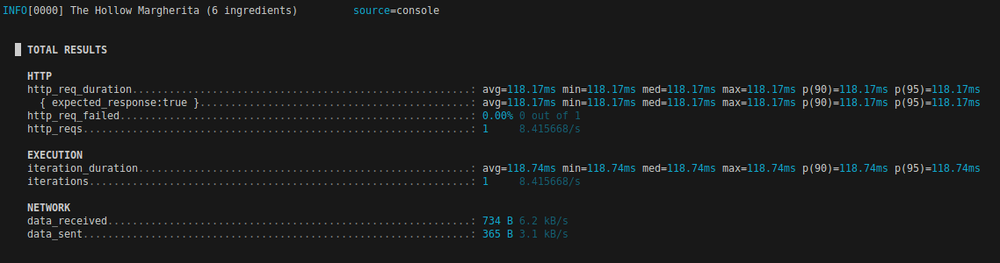
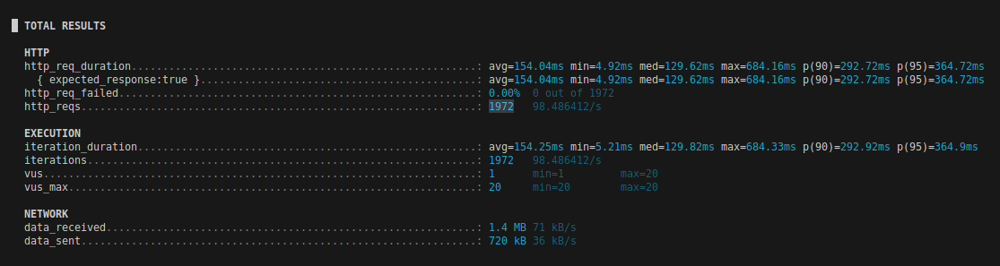
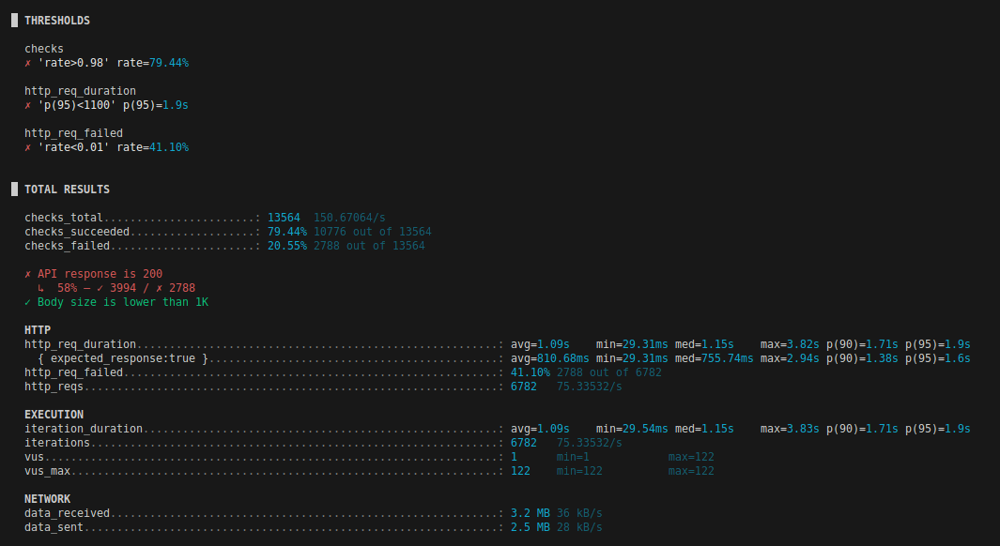

# 7.1 d)

• How long did the API call take: 118.17ms
• How many requests were made: 1
• How many requests failed? (i.e., whose HTTP status code was not 200): 0

# 7.2 a)

• How long did the API calls take on average, minimum and maximum: avg=154.04ms min=4.92ms med=129.62ms max=684.16ms
• How many requests were made: 1972
• How many requests failed? (i.e., whose HTTP status code was not 200): 0

# 7.2 f)

# 7.2 g)

is status 200 and it failed 2703 times
