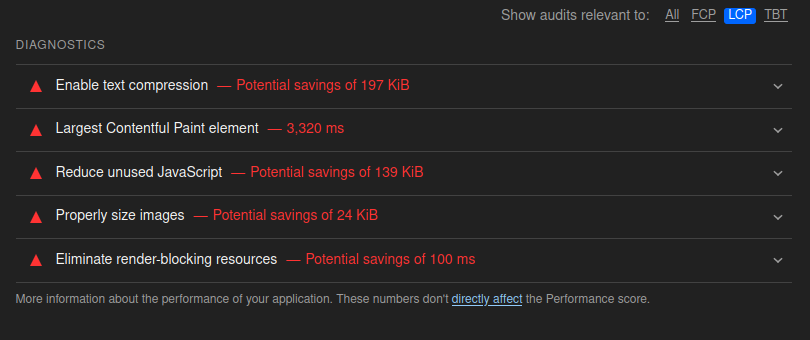
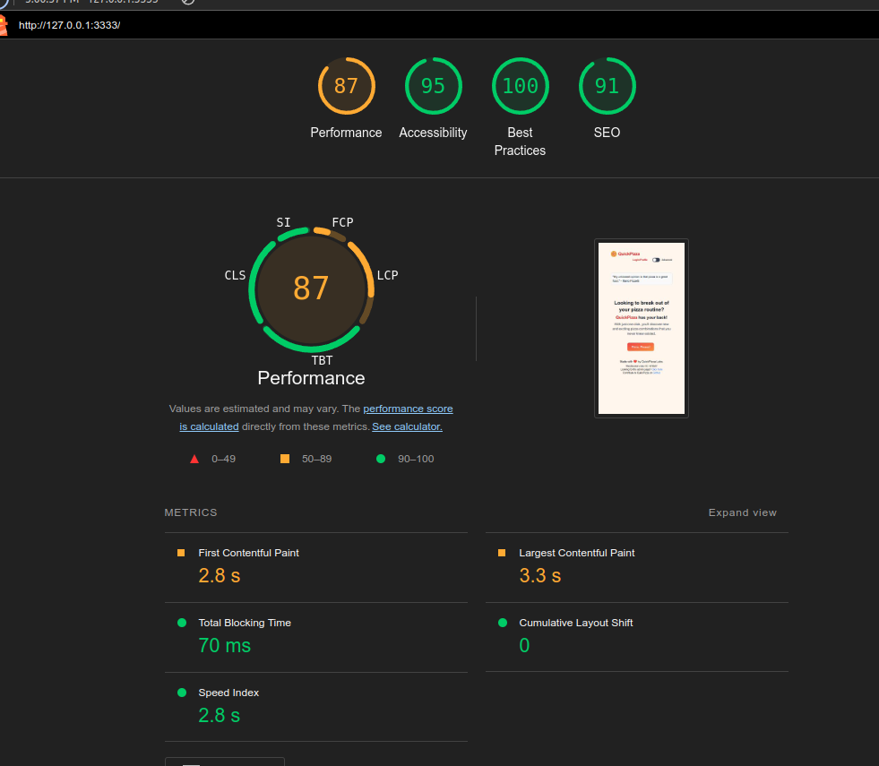
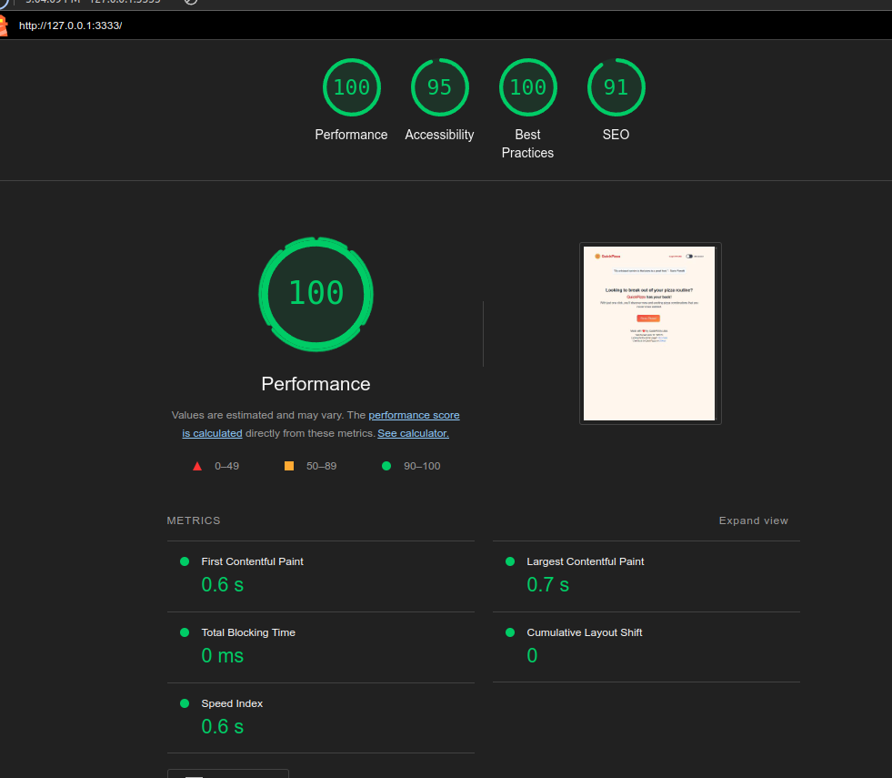
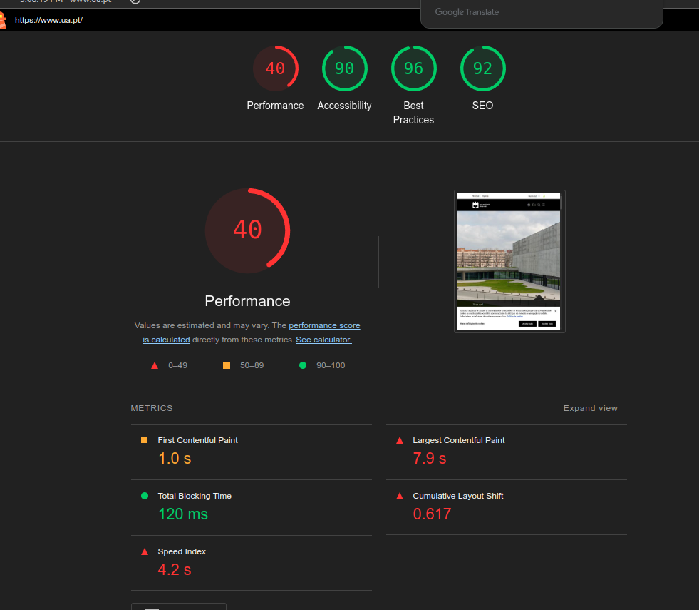
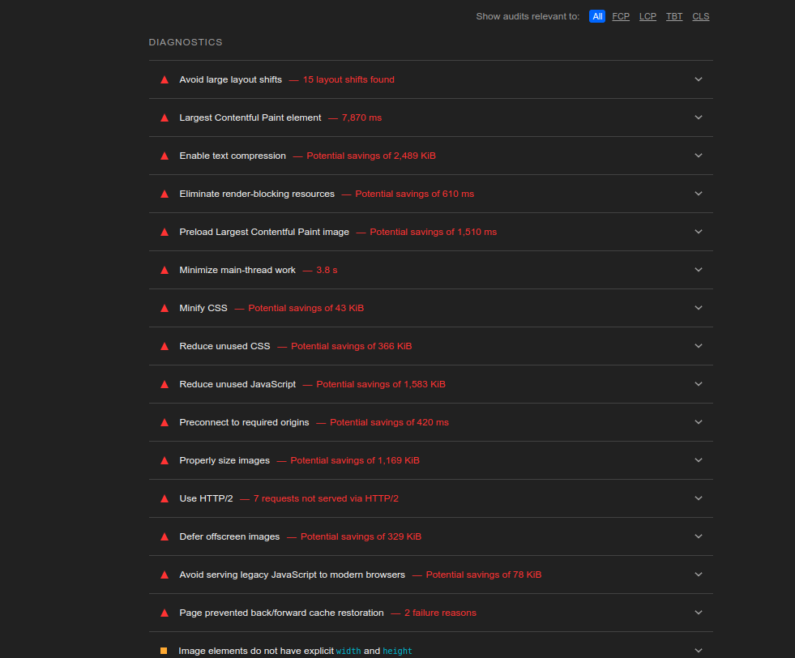

# 7.3 c)

TBT, CLS, LCP

CLS (Cumulative Layout Shift) - Measures the visual stability of a webpage

TBT (Total Blocking Time) - Measures the total amount of time during which the main thread is blocked and unable to respond to user input

LCP (Largest Contentful Paint) - Measures the time taken to render the largest visible content element on the screen

Change the largest contentful paint element

# 7.3 d)

The results look the same, the use of the incognito tab is because avoids cached data and cookies providing a consisten testing environment.

# 7.3 e)

The results are way different, a desktop usually have more processing power than mobile.

# 7.3 f)

These tests are important because a website needs to be fast, user-friendly, and accessible to everyone. Performance affects user experience, SEO helps bring traffic, and best practices ensure security and reliability. A site might work in development but fail under real-world conditions, so testing helps catch these issues early.

# 7.3 g)

The Lighthouse analysis reveals several performance issues that could have been avoided with prior testing. Problems such as unused CSS and JavaScript, inefficient image rendering are negatively impacting load times. Addressing these issues—like minimizing unused code, properly sizing images, significantly improve performance.
