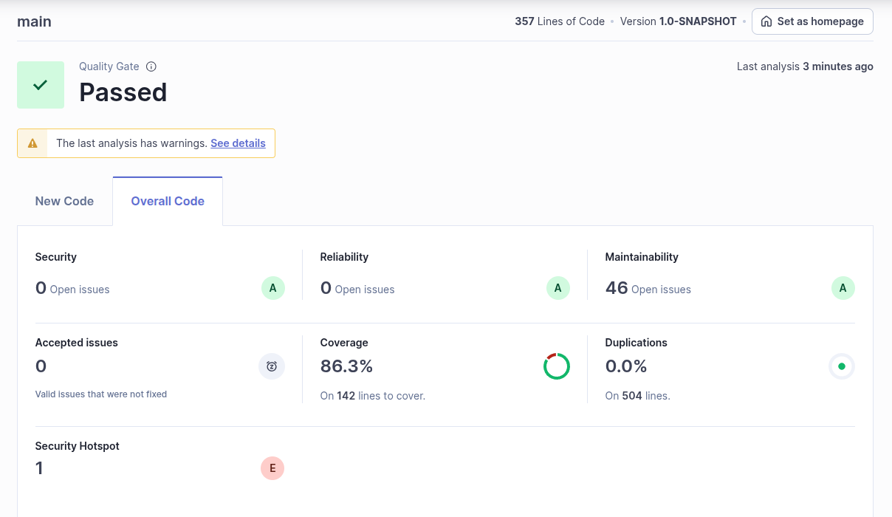

# 8.1 f)

The project has passed the defined quality gate, meaning it meets the required standards despite some maintainability issues and a security hotspot.

# 8.1 g)

| Issue                | Problem Description                                                   | How to Solve                                                                                                                                                                                                                                                                                                                                                                                    |
| -------------------- | --------------------------------------------------------------------- | ----------------------------------------------------------------------------------------------------------------------------------------------------------------------------------------------------------------------------------------------------------------------------------------------------------------------------------------------------------------------------------------------- |
| **Security**         | No open security issues found.                                        | No action required.                                                                                                                                                                                                                                                                                                                                                                             |
| **Reliability**      | No open reliability issues found.                                     | No action required.                                                                                                                                                                                                                                                                                                                                                                             |
| **Maintainability**  | **Issue 1:** Invoke method(s) only conditionally.                     | You should structure your code to pass static or pre-computed values into Preconditions conditions check and logging calls. Specifically, the built-in string formatting should be used instead of string concatenation, and if the message is the result of a method call, then Preconditions should be skipped altogether, and the relevant exception should be conditionally thrown instead. |
|                      | **Issue 2:** Remove Unused imports                                    | Remove unused or not needed reports functions.                                                                                                                                                                                                                                                                                                                                                  |
|                      | **Issue 3:** Complete the task associated to this TODO comment.       | Remove unecessary comments (TODO) if they are not true/needed constants.                                                                                                                                                                                                                                                                                                                        |
|                      | **Issue 4:** Remove this 'public' modifier.                           | Let the visibility be default constants.                                                                                                                                                                                                                                                                                                                                                        |
| **Security Hotspot** | Make sure that using this pseudorandom number generator is safe here. | Use a cryptographically secure pseudo random number generator (CSPRNG) like "java.security.SecureRandom" in place of a non-cryptographic PRNG. Use the generated random values only once. You should not expose the generated random value. If you have to store it, make sure that the database or file is secure.                                                                             |

# 8.1 h)

Checkstyle, PMD, and SpotBugs are external static analysis tools used in Java development to improve code quality by detecting issues early. They are commonly integrated into SonarQube to provide additional insights into code quality.
