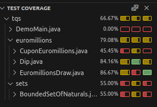
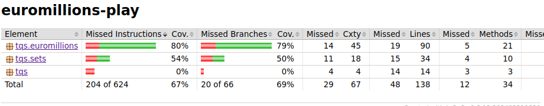
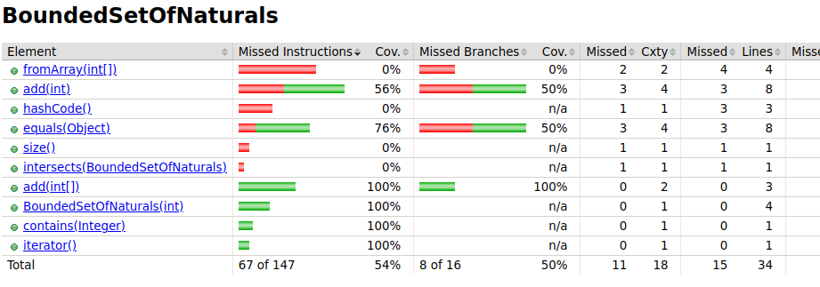
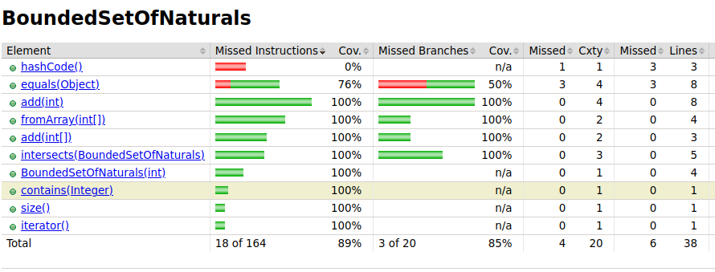

b)

c)

The CuponEuromillions class currently lacks sufficient test coverage, especially for its countDips() and format() methods, which have no unit tests at all. Similarly, the Dip class exhibits low test coverage for both equals() and hashCode() methods. The equals() method only has tests that avoid entering any of its conditional statements, leaving them uncovered. Meanwhile, the hashcode() method is entirely untested. The EuromillionsDraw class has no unit tests for the generateRandomDraw() and getDrawResults() methods, contributing to its low overall coverage.

The BOundedSetOfNaturals class is only 54% covered overall, with just half of its decision branches tested. Several methods fromArray(), hasCode(), size() and intersects() remain untested. The add() method is only 56% covered, with half of its decision branches untested. Similarly, the quals() method has 76% coverage, but also misses half of its decision branches.

d)

complete the testAddElement and the testAddFromArray and add a new test for the intersection(), testIntersection, while also completing intersection().

Now he have way more coverage, we just don't cover the equals and the hashCode()
